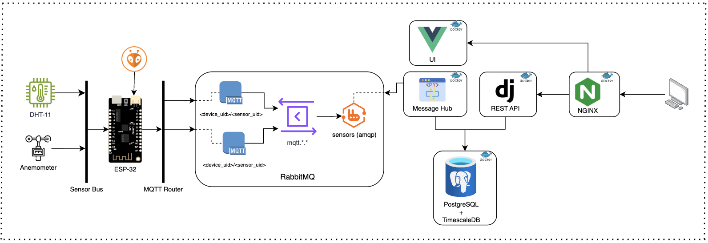
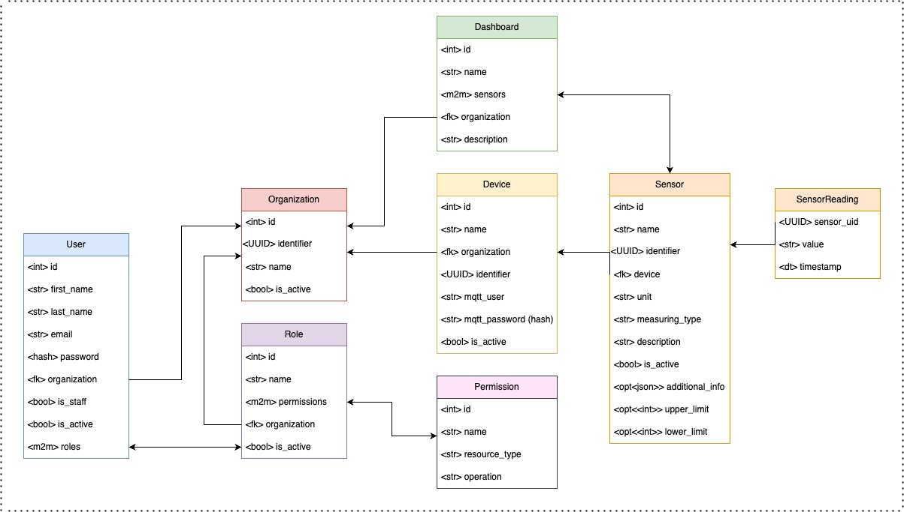

# 🌦️ Metereolog

This project involves the development of weather station and a platform capable of collecting data from various sensors, transmitting them to a central platform, storing them, and making them available through a web interface for visualization and analysis. The architecture is modular and scalable, using modern technologies for each stage of the process.

## 1. Project Overview

The main goal is to create a complete system for weather monitoring. This includes acquiring raw data from sensors, efficiently communicating this data to a central server, persistent storage in a time-series optimized database, and finally, visually and interactively presenting this data to users through a web application. Modularity allows for the easy addition of new sensors or replacement of components without affecting the whole system.

## 2. Project Architecture and Features

The architecture is distributed and based on microservices and asynchronous communication, as shown in the diagram. The main features include:

- **Distributed Data Collection:** Sensors are connected to embedded devices (ESP-32) that act as the network's "edge".
- **Asynchronous, Message-Oriented Communication:** The MQTT protocol is used to transmit data from devices to the message broker (RabbitMQ), ensuring low latency and resilience.
- **Centralized Message Processing:** RabbitMQ acts as a central hub for all sensor messages, enabling routing and processing by other components.
- **Optimized Data Persistence:** PostgreSQL and TimescaleDB provide a robust relational database optimized for time-series data.
- **RESTful API:** Facilitates communication between the frontend and backend, offering access to platform data and functionality.
- **Intuitive User Interface:** A modern, responsive web app allows for visualization and management of station data.
- **Containerization (Docker):** Simplifies deployment, portability, and environment management.
- **Modularity:** Each system component is independent, allowing isolated development and maintenance.

## 3. Modular Project Structure and Technologies Used

### 3.1. Data Acquisition Module (Hardware and Firmware)

- **Sensors:**
  - **DHT-11:** Measures temperature and humidity.
  - **Anemometer:** Measures wind speed.
  - **Wind Direction Sensor:** Measures wind direction.
  - **MQ-6:** Measures petroleum-based gas such as propane and butane

- **ESP-32 (Sensor Bus / MQTT Router):**
  - Microcontroller responsible for reading sensor data.
  - Acts as the local station’s “brain”.
  - Publishes sensor data to the MQTT broker.
  - **Technologies:** PlatformIO (C++ SDK).
  - **Features:**
    - Base libraries for each sensor (DHT-11, Anemometer, Wind Direction).
    - Structured firmware codebase.
    - MQTT integration for data transmission.

### 3.2. Communication and Messaging Module

- **RabbitMQ + MQTT Plugin:**
  - Central message broker for the system.
  - Receives MQTT messages from ESP-32.
  - Forwards them to subscribed components.
  - **Features:**
    - Reliable message delivery.
    - Decoupling producers and consumers.
    - Scalability.
  - **Topic Notation:**  
    - `<device_uid>/<sensor_uid>` = MQTT topics  
    - `mqtt.*` = wildcard listener  
    - `sensors (amqp)` = AMQP forwarding

### 3.3. Data Processing and Persistence Module

- **Message Hub:**
  - Consumes messages from RabbitMQ (`sensors (amqp)`).
  - Validates, transforms, enriches, and stores data.
  - **Technology:** Django (Python).
  - **Features:**
    - Sensor data processing logic.
    - Integration with PostgreSQL + TimescaleDB.

- **PostgreSQL + TimescaleDB:**
  - **PostgreSQL:** Stores users, devices, sensors, roles, permissions, dashboards.
  - **TimescaleDB:** Optimized for time-series sensor readings.
  - **Features:**
    - Efficient data storage (`SensorReading` table).
    - Complex historical query support.
    - System-wide entity management.

### 3.4. Backend Module (API)

- **Django REST API:**
  - Handles communication between frontend and backend.
  - Exposes data and operations through endpoints.
  - **Technology:** Django (Python).
  - **Features:**
    - CRUD endpoints for:
      - Organization (admin only)
      - Role
      - User
      - Device
      - Sensor
      - Dashboards
    - Login endpoint for user authentication.

### 3.5. Frontend Module (User Interface)

- **User Interface (UI):**
  - Web app for interacting with the system.
  - Visualizes sensor data using dashboards.
  - **Technologies:** Vue.js, Quasar, Chart.js.
  - **Features:**
    - Manage Organizations, Users, Devices, Sensors.
    - Create and view custom dashboards.
    - User login.

### 3.6. Web Server Module

- **NGINX:**
  - Reverse proxy for frontend and backend.
  - Serves frontend static files.
  - Manages routing, SSL/TLS, load balancing.
  - **Features:**
    - Optimized content delivery.
    - Unified socket for frontend/backend.
    - Simplified domain/port configuration.

## 4. General Project Features

- **Automated Data Collection:** Continuous readings of temperature, humidity, wind speed/direction, dust/smoke, air quality.
- **Reliable Data Transmission:** MQTT and RabbitMQ ensure delivery.
- **Efficient Time-Series Storage:** TimescaleDB optimized for volume and performance.
- **Entity Management:** Register and manage users, orgs, devices, sensors.
- **Real-Time & Historical Visualization:** Custom dashboards for monitoring.
- **Robust API:** Enables integration and future development.
- **Authentication & Authorization:** Role- and permission-based access.
- **Modularity & Scalability:** Easy to extend sensors, logic, or UI.
- **Simplified Deployment:** Docker streamlines setup and deployment.

## Database Schema

The database schema represents the backend structure for a the web platform, where organizations can manage users, devices, sensors, and dashboards. It is designed with flexibility and scalability in mind, enabling role-based access control, sensor data collection, and customizable dashboards.

At the core of the system is the Organization entity, which acts as a tenant and groups together various resources such as users, devices, and dashboards. Each organization is uniquely identified by a UUID and can be either active or inactive.

Users are associated with a specific organization and can be marked as active or staff (indicating admin-level privileges). Users can have multiple roles, and roles determine their access levels. The Role entity is also organization-specific and connects to a list of Permissions, which define allowed operations on specific resource types, such as sensors or devices.

Devices are the physical units deployed in the field that collect environmental data. Each device belongs to an organization and has unique MQTT credentials for secure communication. Devices can contain multiple sensors, each with a unique identifier. A sensor records specific types of data (e.g., temperature, humidity, gas levels), stores its unit of measurement, and optionally includes configuration such as alert thresholds or additional metadata.

Sensor readings are stored in the SensorReading table, which logs values with timestamps. Each reading is linked to a sensor via its UUID, enabling time-series tracking and analysis of environmental metrics.

To support data visualization and accessibility, the platform includes a Dashboard entity. A dashboard groups together sensors from an organization and provides a human-readable layout to monitor and analyze data. Each dashboard can include multiple sensors and is associated with one organization.

In summary, the system is designed to:

* Support multiple independent organizations.

* Enable fine-grained user permissions through roles and permissions.

* Handle real-time data collection from sensors connected to devices.

* Provide dashboards for data visualization and management.

This schema makes it possible to build a robust, secure, and scalable platform.